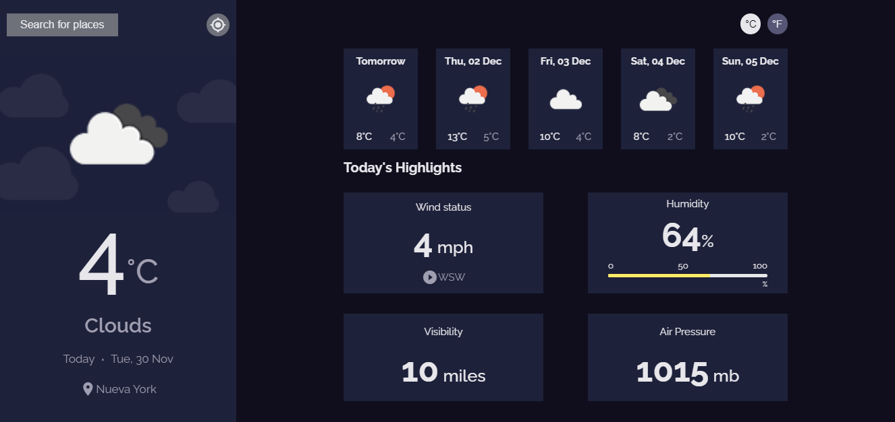
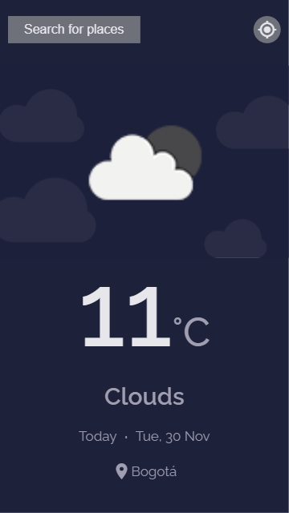

<h1 align="center">Weather App</h1>

> A React web app using geolocation and weather data APIs

### ✨ [Demo](https://react-weather-app-2.herokuapp.com/)

<center>
  <h2>Desktop version</h2>
  
</center>

center>
  <h2>Mobile version</h2>
  
</center>


 The meteorological application created with React JS, connects the opencagedata and openweathermap APIs, to obtain the coordinates and the weather, respectively, it will dynamically render the weather data, in the desktop version you can see the units in celsius or in fahrenheits, either whatever your preference.
 The search form consoults opencagedata  to verify if the user's input corresponds to a valid location.
## Install

```sh
git clone git@github.com:crisav/WeatherApp.git
cd weather-app
npm install
npm run build
```

## Usage

```sh
npm start
```

> Runs the app in the development mode.\
> Open [http://localhost:3000](http://localhost:3000) to view it in the browser.

## 📝 License

Copyright © 2019 [Cristian Vega](https://github.com/crisav).<br />
This project is MIT licensed.

***
